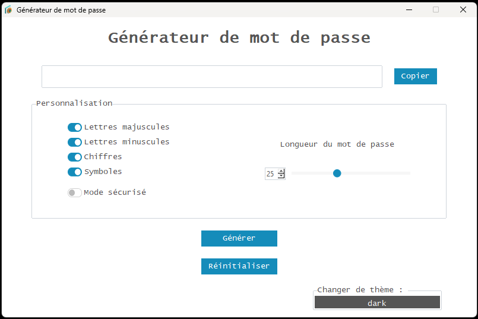

# Password Generator

A modern and secure password generator built with Python and tkinter, featuring a beautiful UI with ttkbootstrap theming.

## Screenshots

### Dark Theme


### Light Theme


## Features

- **Customizable Password Generation**: Choose from uppercase letters, lowercase letters, numbers, and special characters
- **Adjustable Length**: Generate passwords from 1 to 64 characters long
- **Safe Mode**: Option to exclude problematic characters for better compatibility
- **Modern UI**: Beautiful interface with dark and light theme support
- **Copy to Clipboard**: One-click password copying functionality
- **Secure Generation**: Uses cryptographically secure random generation

## Installation

### Option 1: Use the Executable (Recommended)
1. Download the latest release from the repository
2. Run `Générateur de mots de passe modern.exe` directly - no installation required!

### Option 2: Run from Source Code
1. Clone this repository:
```bash
git clone https://github.com/yourusername/password-generator.git
cd password-generator
```

2. Install the required dependencies:
```bash
pip install -r requirements.txt
```

## Usage

### Option 1: Use the Executable (Recommended for End Users)
Simply double-click `Générateur de mots de passe modern.exe` to launch the application directly without needing Python installed.

### Option 2: Run from Source Code
```bash
python "Générateur de mots de passe modern.py"
```

> **⚠️ Important Note**: The file `générateur de mots de passe.py` is deprecated and should not be used. It's an older version that lacks modern features and theming. Always use `Générateur de mots de passe modern.py` for the best experience.

## Project Structure

```
password-generator/
├── Générateur de mots de passe modern.exe    # Ready-to-use executable
├── Générateur de mots de passe modern.py     # Main application (modern version)
├── générateur de mots de passe.py            # ⚠️ Deprecated - do not use
├── icon.ico                                  # Application icon
├── images/                                   # Screenshots and documentation images
│   ├── screenshot_dark.png                   # Dark theme preview
│   └── screenshot_light.png                  # Light theme preview
├── LICENSE                                   # MIT License
├── README.md                                 # This documentation
└── requirements.txt                          # Python dependencies
```

## User Interface Guide

The password generator interface is divided into several intuitive sections:

### 1. **Main Password Display Area**
- **Generated Password Field**: Shows your generated password in a large, readable font
- **Copy Button**: Click to instantly copy the password to your clipboard
- **Tooltip**: Hover over buttons for helpful information

### 2. **Customization Panel**
This section allows you to customize your password generation:

#### Character Types:
- ✅ **Uppercase Letters (A-Z)**: Include capital letters
- ✅ **Lowercase Letters (a-z)**: Include small letters  
- ✅ **Numbers (0-9)**: Include digits
- ✅ **Symbols**: Include special characters like !@#$%^&*()
- ⚠️ **Safe Mode**: When enabled, excludes problematic characters that might cause issues in terminals or web forms

#### Password Length:
- **Slider Control**: Drag to adjust password length (1-64 characters)
- **Real-time Preview**: Password updates automatically as you move the slider

### 3. **Action Buttons**
- **Generate**: Create a new password with current settings
- **Reset**: Restore all settings to default values

### 4. **Theme Controls**
- **Theme Toggle**: Switch between dark and light interface themes

## Usage Tips

### For Maximum Security:
1. **Use all character types**: Enable uppercase, lowercase, numbers, and symbols
2. **Longer is better**: Use passwords of at least 12-16 characters
3. **Disable Safe Mode**: Only use Safe Mode if you encounter compatibility issues

### For Compatibility:
1. **Enable Safe Mode**: If the password will be used in terminals or legacy systems
2. **Test your password**: Always test your generated password in the target system
3. **Keep a backup**: Consider generating multiple passwords and testing them

### Best Practices:
- **Unique passwords**: Generate a different password for each account
- **Regular updates**: Change passwords periodically
- **Secure storage**: Use a password manager to store generated passwords
- **Copy safely**: Clear your clipboard after pasting the password

### Features Overview

- **Uppercase Letters**: Include A-Z in your password
- **Lowercase Letters**: Include a-z in your password  
- **Numbers**: Include 0-9 in your password
- **Special Characters**: Include symbols like !@#$%^&*()
- **Safe Mode**: Excludes potentially problematic characters for better compatibility with terminals and web browsers
- **Password Length**: Adjust from 1-64 characters using the slider
- **Theme Toggle**: Switch between dark and light themes

## Upcoming Features

- **Multi-language Support**: The application will support multiple languages including:
  - English
  - French
  - Spanish
  - German
  - And more...

## Requirements

- Python 3.7+
- tkinter (usually included with Python)
- ttkbootstrap
- pyperclip

## License

This project is licensed under the MIT License - see the [LICENSE](LICENSE) file for details.

## Author

**Joël Smith-Gravel**

Development : (2023-04-17)

## Contributing

Contributions are welcome! Please feel free to submit a Pull Request.

## Security

This password generator uses Python's `secrets` module for cryptographically secure random number generation, ensuring your passwords are truly random and secure.