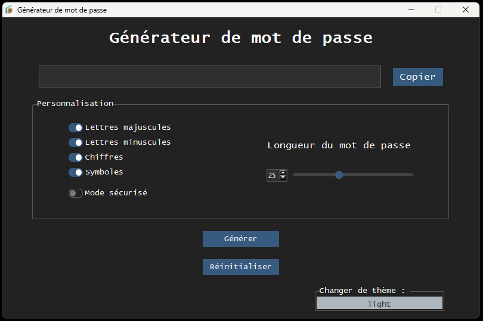

# 🔐 Password Generator

A modern and secure password generator built with Python and tkinter, featuring a beautiful UI with ttkbootstrap theming.

## 📸 Screenshots

### 🌙 Dark Theme


### ☀️ Light Theme


## ✨ Features

- **🎛️ Customizable Password Generation**: Choose from uppercase letters, lowercase letters, numbers, and special characters
- **📏 Adjustable Length**: Generate passwords from 1 to 64 characters long
- **🛡️ Safe Mode**: Option to exclude problematic characters for better compatibility
- **🎨 Modern UI**: Beautiful interface with dark and light theme support
- **📋 Copy to Clipboard**: One-click password copying functionality
- **🔒 Secure Generation**: Uses cryptographically secure random generation

## 💾 Installation

### 🚀 Option 1: Use the Executable (Recommended)
1. Download the latest release from the repository
2. Run `Générateur de mots de passe modern.exe` directly - no installation required!

### 💻 Option 2: Run from Source Code
1. Clone this repository:
```bash
git clone https://github.com/yourusername/password-generator.git
cd password-generator
```

2. Install the required dependencies:
```bash
pip install -r requirements.txt
```

## 🎯 Usage

### 🚀 Option 1: Use the Executable (Recommended for End Users)
Simply double-click `Générateur de mots de passe modern.exe` to launch the application directly without needing Python installed.

### 💻 Option 2: Run from Source Code
```bash
python "Générateur de mots de passe modern.py"
```

> **⚠️ Important Note**: The file `générateur de mots de passe.py` is deprecated and should not be used. It's an older version that lacks modern features and theming. Always use `Générateur de mots de passe modern.py` for the best experience.

## 📁 Project Structure

```
password-generator/
├── Générateur de mots de passe modern.exe    # Ready-to-use executable
├── Générateur de mots de passe modern.py     # Main application (modern version)
├── générateur de mots de passe.py            # ⚠️ Deprecated - do not use
├── icon.ico                                  # Application icon
├── images/                                   # Screenshots and documentation images
│   ├── screenshot_dark.png                   # Dark theme preview
│   └── screenshot_light.png                  # Light theme preview
├── LICENSE                                   # MIT License
├── README.md                                 # This documentation
└── requirements.txt                          # Python dependencies
```

## 📖 User Interface Guide

The password generator interface is divided into several intuitive sections:

### 1. **🖥️ Main Password Display Area**
- **🔤 Generated Password Field**: Shows your generated password in a large, readable font
- **📋 Copy Button**: Click to instantly copy the password to your clipboard
- **💡 Tooltip**: Hover over buttons for helpful information

### 2. **⚙️ Customization Panel**
This section allows you to customize your password generation:

#### 🔤 Character Types:
- ✅ **🔠 Uppercase Letters (A-Z)**: Include capital letters
- ✅ **🔡 Lowercase Letters (a-z)**: Include small letters  
- ✅ **🔢 Numbers (0-9)**: Include digits
- ✅ **🔣 Symbols**: Include special characters like !@#$%^&*()
- ⚠️ **🛡️ Safe Mode**: When enabled, excludes problematic characters that might cause issues in terminals or web forms

#### 📏 Password Length:
- **🎚️ Slider Control**: Drag to adjust password length (1-64 characters)
- **⚡ Real-time Preview**: Password updates automatically as you move the slider

### 3. **🎮 Action Buttons**
- **⚡ Generate**: Create a new password with current settings
- **🔄 Reset**: Restore all settings to default values

### 4. **🎨 Theme Controls**
- **🌓 Theme Toggle**: Switch between dark and light interface themes

## 💡 Usage Tips

### 🔒 For Maximum Security:
1. **🎛️ Use all character types**: Enable uppercase, lowercase, numbers, and symbols
2. **📏 Longer is better**: Use passwords of at least 12-16 characters
3. **🛡️ Disable Safe Mode**: Only use Safe Mode if you encounter compatibility issues

### 🔧 For Compatibility:
1. **🛡️ Enable Safe Mode**: If the password will be used in terminals or legacy systems
2. **🧪 Test your password**: Always test your generated password in the target system
3. **💾 Keep a backup**: Consider generating multiple passwords and testing them

### ⭐ Best Practices:
- **🔑 Unique passwords**: Generate a different password for each account
- **🔄 Regular updates**: Change passwords periodically
- **💾 Secure storage**: Use a password manager to store generated passwords
- **📋 Copy safely**: Clear your clipboard after pasting the password

### 📋 Features Overview

- **🔠 Uppercase Letters**: Include A-Z in your password
- **🔡 Lowercase Letters**: Include a-z in your password  
- **🔢 Numbers**: Include 0-9 in your password
- **🔣 Special Characters**: Include symbols like !@#$%^&*()
- **🛡️ Safe Mode**: Excludes potentially problematic characters for better compatibility with terminals and web browsers
- **📏 Password Length**: Adjust from 1-64 characters using the slider
- **🌓 Theme Toggle**: Switch between dark and light themes

## 🚀 Upcoming Features

- **🌐 Multi-language Support**: The application will support multiple languages including:
  - 🇺🇸 English
  - 🇫🇷 French
  - 🇪🇸 Spanish
  - 🇩🇪 German
  - And more...

## 📋 Requirements

- 🐍 Python 3.7+
- 🖼️ tkinter (usually included with Python)
- 🎨 ttkbootstrap
- 📋 pyperclip

## 📄 License

This project is licensed under the MIT License - see the [LICENSE](LICENSE) file for details.

## 👨‍💻 Author

**Joël Smith-Gravel**

Development : (2023-04-17)

## 🤝 Contributing

Contributions are welcome! Please feel free to submit a Pull Request.

## 🔐 Security

This password generator uses Python's `secrets` module for cryptographically secure random number generation, ensuring your passwords are truly random and secure.