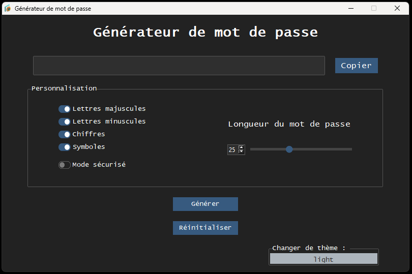
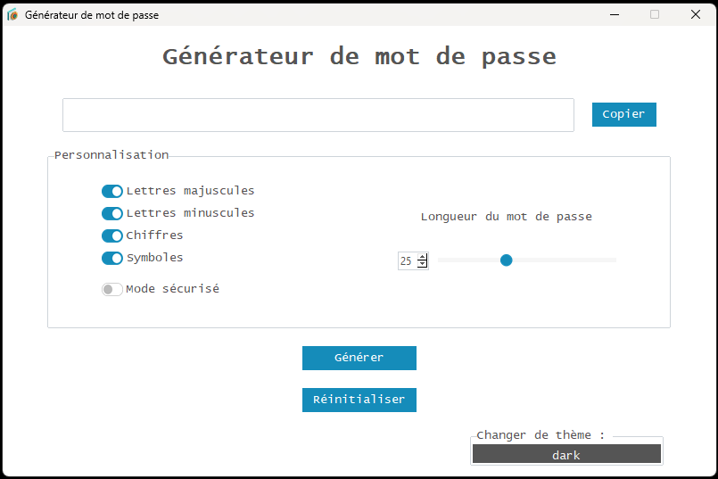

# Générateur de Mots de Passe

Un générateur de mots de passe moderne et sécurisé développé avec Python et tkinter, doté d'une interface utilisateur élégante avec le thème ttkbootstrap.

## Captures d'écran

### Thème Sombre


### Thème Clair


## Fonctionnalités

- **Génération de mots de passe personnalisable** : Choisissez parmi les lettres majuscules, minuscules, chiffres et caractères spéciaux
- **Longueur ajustable** : Générez des mots de passe de 1 à 64 caractères
- **Mode sécurisé** : Option d'exclure les caractères problématiques pour une meilleure compatibilité
- **Interface moderne** : Belle interface avec support des thèmes sombre et clair
- **Copie dans le presse-papiers** : Fonction de copie de mot de passe en un clic
- **Génération sécurisée** : Utilise une génération aléatoire cryptographiquement sécurisée

## Installation

### Option 1 : Utiliser l'exécutable (Recommandé)
1. Téléchargez la dernière version depuis le dépôt
2. Exécutez `Générateur de mots de passe modern.exe` directement - aucune installation requise !

### Option 2 : Exécuter depuis le code source
1. Clonez ce dépôt :
```bash
git clone https://github.com/yourusername/password-generator.git
cd password-generator
```

2. Installez les dépendances requises :
```bash
pip install -r requirements.txt
```

## Utilisation

### Option 1 : Utiliser l'exécutable (Recommandé pour les utilisateurs finaux)
Double-cliquez simplement sur `Générateur de mots de passe modern.exe` pour lancer l'application directement sans avoir besoin d'installer Python.

### Option 2 : Exécuter depuis le code source
```bash
python "Générateur de mots de passe modern.py"
```

> **⚠️ Note importante** : Le fichier `générateur de mots de passe.py` est obsolète et ne doit pas être utilisé. C'est une ancienne version qui manque de fonctionnalités modernes et de thématisation. Utilisez toujours `Générateur de mots de passe modern.py` pour la meilleure expérience.

## Structure du projet

```
password-generator/
├── Générateur de mots de passe modern.exe    # Exécutable prêt à utiliser
├── Générateur de mots de passe modern.py     # Application principale (version moderne)
├── générateur de mots de passe.py            # ⚠️ Obsolète - ne pas utiliser
├── icon.ico                                  # Icône de l'application
├── images/                                   # Captures d'écran et images de documentation
│   ├── screenshot_dark.png                   # Aperçu du thème sombre
│   └── screenshot_light.png                  # Aperçu du thème clair
├── LICENSE                                   # Licence MIT
├── README.md                                 # Cette documentation
└── requirements.txt                          # Dépendances Python
```

## Guide de l'interface utilisateur

L'interface du générateur de mots de passe est divisée en plusieurs sections intuitives :

### 1. **Zone d'affichage principal du mot de passe**
- **Champ du mot de passe généré** : Affiche votre mot de passe généré dans une police grande et lisible
- **Bouton Copier** : Cliquez pour copier instantanément le mot de passe dans votre presse-papiers
- **Info-bulle** : Survolez les boutons pour obtenir des informations utiles

### 2. **Panneau de personnalisation**
Cette section vous permet de personnaliser la génération de votre mot de passe :

#### Types de caractères :
- ✅ **Lettres majuscules (A-Z)** : Inclure les lettres capitales
- ✅ **Lettres minuscules (a-z)** : Inclure les petites lettres
- ✅ **Chiffres (0-9)** : Inclure les chiffres
- ✅ **Symboles** : Inclure les caractères spéciaux comme !@#$%^&*()
- ⚠️ **Mode sécurisé** : Lorsqu'activé, exclut les caractères problématiques qui peuvent causer des problèmes dans les terminaux ou formulaires web

#### Longueur du mot de passe :
- **Contrôle par curseur** : Faites glisser pour ajuster la longueur du mot de passe (1-64 caractères)
- **Aperçu en temps réel** : Le mot de passe se met à jour automatiquement lorsque vous bougez le curseur

### 3. **Boutons d'action**
- **Générer** : Créer un nouveau mot de passe avec les paramètres actuels
- **Réinitialiser** : Restaurer tous les paramètres aux valeurs par défaut

### 4. **Contrôles de thème**
- **Basculer le thème** : Changer entre les thèmes d'interface sombre et clair

## Conseils d'utilisation

### Pour une sécurité maximale :
1. **Utilisez tous les types de caractères** : Activez majuscules, minuscules, chiffres et symboles
2. **Plus long c'est mieux** : Utilisez des mots de passe d'au moins 12-16 caractères
3. **Désactivez le mode sécurisé** : N'utilisez le mode sécurisé que si vous rencontrez des problèmes de compatibilité

### Pour la compatibilité :
1. **Activez le mode sécurisé** : Si le mot de passe sera utilisé dans des terminaux ou systèmes anciens
2. **Testez votre mot de passe** : Testez toujours votre mot de passe généré dans le système cible
3. **Gardez une sauvegarde** : Considérez générer plusieurs mots de passe et les tester

### Meilleures pratiques :
- **Mots de passe uniques** : Générez un mot de passe différent pour chaque compte
- **Mises à jour régulières** : Changez les mots de passe périodiquement
- **Stockage sécurisé** : Utilisez un gestionnaire de mots de passe pour stocker les mots de passe générés
- **Copie sécurisée** : Videz votre presse-papiers après avoir collé le mot de passe

### Aperçu des fonctionnalités

- **Lettres majuscules** : Inclure A-Z dans votre mot de passe
- **Lettres minuscules** : Inclure a-z dans votre mot de passe
- **Chiffres** : Inclure 0-9 dans votre mot de passe
- **Caractères spéciaux** : Inclure des symboles comme !@#$%^&*()
- **Mode sécurisé** : Exclut les caractères potentiellement problématiques pour une meilleure compatibilité avec les terminaux et navigateurs web
- **Longueur du mot de passe** : Ajustez de 1-64 caractères en utilisant le curseur
- **Basculer le thème** : Changez entre les thèmes sombre et clair

## Fonctionnalités à venir

- **Support multilingue** : L'application supportera plusieurs langues incluant :
  - Anglais
  - Français
  - Espagnol
  - Allemand
  - Et plus encore...

## Prérequis

- Python 3.7+
- tkinter (généralement inclus avec Python)
- ttkbootstrap
- pyperclip

## Licence

Ce projet est sous licence MIT - voir le fichier [LICENSE](LICENSE) pour plus de détails.

## Auteur

**Joël Smith-Gravel**

Développement : (2023-04-17)

## Contribution

Les contributions sont les bienvenues ! N'hésitez pas à soumettre une Pull Request.

## Sécurité

Ce générateur de mots de passe utilise le module `secrets` de Python pour la génération de nombres aléatoires cryptographiquement sécurisée, garantissant que vos mots de passe sont vraiment aléatoires et sécurisés.
